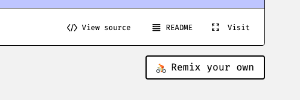

# A Hitchhiker's Guide to APIs

All of this code exists both as a Glitch project and a [Github repository](https://github.com/jkeefe/api-workshop).

## Getting ready for this workshop

### While you are waiting

- Sign up for a free account at [Glitch](https://glitch.com/) and log in.
- If you don't already have one, add a JSON viewer to your web browser:
    - Chrome: [JSON Viewer](https://chrome.google.com/webstore/detail/json-viewer/gbmdgpbipfallnflgajpaliibnhdgobh?hl=en-US)
    - Firefox: [JSONView](https://addons.mozilla.org/en-US/firefox/addon/jsonview/)
    - Safari: [PrettyJSON](https://apps.apple.com/app/id1445328303?mt=12)

### I'll walk you through this part

#### Clone my Glitch project

- In Glitch, [search](https://glitch.com/search?q=api-workshop) for `api-workshop`
- See mine in the window, and click it
- Look for the "Remix Your Own" button, and click that:

- You now have your _very own copy_ of this project
- This tab will be your "project" tab

#### Open a Glitch terminal tab

- Along the bottom of the screen, click the "Terminal" button
- Then click the "Full Page Terminal" button
- You'll have a new tab in your browser I'll be calling your "terminal" tab

#### Open a blank browser tab

- We'll call this our "testing" tab

## Quick API examples

### CDC Vaccinations

Suggested by [Sharon Lurye](https://twitter.com/sharonlurye/status/1493581767001133059?s=20&t=GwIge5hkYAqo09c5neJKGg), this is an example of a rich, important dataset updated frequently.

- Documentation: https://data.cdc.gov/Vaccinations/COVID-19-Vaccinations-in-the-United-States-County/8xkx-amqh
    - Click the "API" button
- Examples:
    - Latest data: https://data.cdc.gov/resource/8xkx-amqh.json


### US Naval Observatory Astronomical Applications API

Suggested by [Casey Miller](https://twitter.com/caseymmiller/status/1493288111970811904?s=20&t=GwIge5hkYAqo09c5neJKGg)

- Documentation: https://aa.usno.navy.mil/data/api
- Examples:
    - All of the moon phases in 1984: https://aa.usno.navy.mil/api/moon/phases/year?year=1984
    - Solar eclipses in 2022: https://aa.usno.navy.mil/api/eclipses/solar/year?year=2022
    - Seasons for 2022 in US Eastern Time: https://aa.usno.navy.mil/api/seasons?year=2022&tz=-5&dst=true
    - Daylight Saving: https://aa.usno.navy.mil/api/daylightsaving?year=2022

## The basics

### What's going on here?

Here's a little [chart](./reference/api_flows.pdf) to help explain.

### Request: What you send

Essentially, a specifically-formatted URL.

Like: https://aa.usno.navy.mil/api/seasons?year=2022&tz=-5&dst=true

### Response: What you get

Data ... usually structured in JSON format (though sometimes other formats are available).

### Reading API docs

- The base url: 
    - `https://aa.usno.navy.mil/api/`
- The endpoint: 
    - `https://aa.usno.navy.mil/api/seasons`
    - or, in some documentation, just `seasons`
- The parameters
    - Described in the [documentation for the seasons](https://aa.usno.navy.mil/data/api#seasons)
    - Required:
        - `?year=YEAR`
    - Optional:
        - `&tz=OFFSET`
        - `&dst=TRUEFALSE`
    - Example: 
        - "Generate the dates and times of Earth's seasons and apsides in 2007 for Central Time (US), with times adjusted for daylight saving when appropriate:"
        - `https://aa.usno.navy.mil/api/seasons?year=2022&tz=-6&dst=true`
- Rate limits
    - Is there a limited number of times you can hit the API?
- Prices
    - Does it cost money?
    - At what point does it cost money?
- Terms of Service & License
    - Are you allowed to use the data in the way you want to?
    
### Using The Data

Back to the CDC example ... but on the command line:

```
curl "https://data.cdc.gov/resource/8xkx-amqh.json" > ./data/vaccinations.json
```

... which you could run from a cron job or a [GitHub Action](https://simonwillison.net/2020/Oct/9/git-scraping/).
    

### API Keys

Often, your access requires an API key, which is usually a string of letters and numbers. You need to first acquire a key and then send it along with your "request" ... in whatever way the documentation says to do so.

Sometimes, that's in the url ... as in the Open Weather Map API.

#### Open Weather Map

- Documentation: https://openweathermap.org/api
- Getting an API key: https://openweathermap.org/home/sign_up
https://openweathermap.org/current
- Current Weather: 
```
# format:
api.openweathermap.org/data/2.5/weather?lat={lat}&lon={lon}&appid={API key}

# atlanta:
api.openweathermap.org/data/2.5/weather?lat=33.7490&lon=-84.3880&appid={API key}

# in degrees F
api.openweathermap.org/data/2.5/weather?lat=33.7490&lon=-84.3880&units=imperial&appid={API key}
```

#### ProPublica's Congress API

- Documentation: https://projects.propublica.org/api-docs/congress-api/
- Get your API key: https://www.propublica.org/datastore/api/propublica-congress-api
- Scroll down the documentation to see how to use your key, and you'll see that you need to send the key in the "header" of the request, which you can do on the command line like this:

```
curl "api_endpoint_here"
  -H "X-API-Key: PROPUBLICA_API_KEY"
```

This can also be written as:

```
curl "api_endpoint_here" -H "X-API-Key: PROPUBLICA_API_KEY"
```

- Example ... on the command line:
```
# see the data
curl "https://api.propublica.org/congress/v1/117/house/members.json" -H "X-API-Key: PROPUBLICA_API_KEY"

# save the data to a file: 
curl "https://api.propublica.org/congress/v1/117/house/members.json" -H "X-API-Key: PROPUBLICA_API_KEY" > ./data/house_members.json
```

Why would you want a list of house members? 

#### API Key Security

- You don't want your API keys in the open!
    - Generally I use them server-side
    - Check to make sure it's okay to store data like this
    - Often services _would rather_ you store what you fetch yourself
    
- There are some exceptions to that
    - Mapping services, for example, will often charge by how many of your readers/viewers hit the map
    - In this case, there are special restrictions put on the API keys, so you can have them in public
    
- In this project, with this code, they are stored in the `.env` file. Glitch didn't copy over my values when you clone this project ... so you can add them yourself!

### OAuth

A more sophisticated (and complicated) way of authenticating.

#### Spotify API

Suggested by [Roberto Rocha](https://twitter.com/robroc/status/1493281139422814210?s=20&t=GwIge5hkYAqo09c5neJKGg)

- Documentation: https://developer.spotify.com/documentation/web-api/
- Endpoints: https://developer.spotify.com/documentation/web-api/reference/#/
- Node module: https://www.npmjs.com/package/spotify-web-api-node

JK: Build an example in node.


## Uses

### Use in a Makefile
 
Give an example of an example that turns the Congress API into a CSV

### Run that in a Github Action

Link out to Simon's work

### Feeding your own apps

- Airtable has [separate endpoints](https://airtable.com/api) for each "base"
- Trello has an [API](https://developer.atlassian.com/cloud/trello/rest/api-group-actions/)
- Github has an extensive [API](https://docs.github.com/en/rest)

### Making a Google Sheets "Dashboard"

- Coinbase API: http://api.coinbase.com
- The data we want is at this endpoint: https://api.coinbase.com/v2/prices/BTC-USD/spot
- See the example in a Google Sheet
- See [how to make this yourself](examples/sheets_plus_coinbase.md)

### Triggering things in the real world

- Sending a Slack message
- Sending a text message.

Use environment secrets to send a message to a phone number.

## Moar examples

### Tracking local data

- [Minneapolis police incidents](https://opendata.minneapolismn.gov/datasets/cityoflakes::police-incidents-2022/about)
  - [API explorer](https://opendata.minneapolismn.gov/datasets/cityoflakes::police-incidents-2022/api)
    - Note that "where" isn't location ... it's a SQL-like search

### USGS Earthquakes

- Main documentation: https://earthquake.usgs.gov/earthquakes/feed/v1.0/geojson.php
- Example:
    - All of the 4.5M+ quakes today: https://earthquake.usgs.gov/earthquakes/feed/v1.0/summary/4.5_day.geojson
    

### US Census API

Suggested by [Alex Garcia](https://twitter.com/agarcia_me/status/1493289875948269572?s=20&t=GwIge5hkYAqo09c5neJKGg)

- Overall Documentation: https://www.census.gov/data/developers/data-sets.html
- 2020 "Documentation": https://api.census.gov/data/2020/dec/pl.html
- 2020 Examples: https://api.census.gov/data/2020/dec/pl/examples.html
- 2020 Variables: https://api.census.gov/data/2020/dec/pl/variables.html
- Examples:
    - State FIPS Codes: https://api.census.gov/data/2020/dec/pl?get=NAME&for=state:*
    - Georgia population by county: https://api.census.gov/data/2020/dec/pl?get=P1_001N&for=county:*&in=state:13

### Sports

#### National Hockey League

Suggested by [Jon Schwabish](https://twitter.com/jschwabish/status/1493378638493925378?s=20&t=GwIge5hkYAqo09c5neJKGg)

- Unofficial documentation: https://gitlab.com/dword4/nhlapi
- Statistics documentation and examples: https://gitlab.com/dword4/nhlapi/-/blob/master/stats-api.md
- Node crawler: https://www.npmjs.com/package/nhl-api-crawler
- R package: https://cran.r-project.org/web/packages/nhlapi/index.html

#### National Basketball League

Suggested by [Matt Waite](https://twitter.com/mattwaite/status/1493276564351455232)

Undocumented, but packages exist:

- Python package: https://github.com/swar/nba_api
- R package: https://hoopr.sportsdataverse.org/


### PokeAPI

Suggested by [Ryan Murphy](https://twitter.com/rdmurphy/status/1493275555512217606?s=20&t=GwIge5hkYAqo09c5neJKGg)

- Documentation: https://pokeapi.co/docs/v2
- Example: https://pokeapi.co/api/v2/pokemon/charmander/
    - Fun nugget: .sprites.other.home.front_default[https://raw.githubusercontent.com/PokeAPI/sprites/master/sprites/pokemon/other/home/4.png]

#### Mega list of APIS

Suggested by [@ADoug](https://twitter.com/ADoug/status/1495962857032359946?s=20&t=u7IILOwOh82LGwW3wpyeRg)

[The List](https://github.com/public-apis/public-apis)
    
    
## Closing thoughts

Rachel Shorey [points out](https://twitter.com/rachel_shorey/status/1493293227704823808?s=20&t=GwIge5hkYAqo09c5neJKGg) that oftentimes you can find APIs by looking at the console for a site you're browsing.

Jeremy Bowers [mentioned](https://twitter.com/jeremybowers/status/1493275883695751173?s=20&t=GwIge5hkYAqo09c5neJKGg) that there's an undocumented API powering all the jurisictions that use Clarity to post their election results.

ESRI, on the other hand, has a [well-documented API](https://developers.arcgis.com/rest/services-reference/enterprise/get-started-with-the-services-directory.htm) that underlies many maps government maps and dashboards. (And, as we saw, have made them easier to use in the interfaces, too.)

I'd note that although there's definitely a [National Weather Service API](https://www.weather.gov/documentation/services-web-api), you can find json sources for things such as [snow reports](https://www.weather.gov/source/crh/lsr_snow.geojson) under places like [this map](https://www.weather.gov/source/crh/snowmap.html)

## Questions?


## This site is built with Glitch

[Glitch](https://glitch.com) is a friendly community where millions of people come together to build web apps and websites.

- Need more help? [Check out our Help Center](https://help.glitch.com/) for answers to any common questions.
- Ready to make it official? [Become a paid Glitch member](https://glitch.com/pricing) to boost your app with private sharing, more storage and memory, domains and more.
